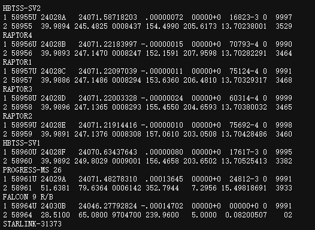

# 卫星轨道与观察角计算与可视化

## 程序代码

```python
import ephem
import math
import matplotlib.pyplot as plt
import numpy as np
from matplotlib.animation import FuncAnimation

time_interval=20#时间粒度
steps=500#部数

me=ephem.Observer()
me.lon, me.lat, me.elevation = '116.3912757', '39.906217', 400.0
sat1 = ephem.readtle("COSMOS 2429 [-] ",
"1 54216U 22143A   24065.24608156  .00040448  00000-0  43283-3 0  9992",
"2 54216  41.4693 358.3170 0006699 108.4098 251.7470 15.63070390 76669")
sat2 = ephem.readtle("SYNCOM 2 (A 26)  ",
"1 00634U 63031A   24051.02891373 -.00000032  00000+0  00000+0 0  9995",
"2 00634  31.7693 312.3291 0008086 187.3721  89.0546  1.00256666221858")
sat=[sat1,sat2]
sat_num=2
me.date = ephem.now()  #ephem.now()

def lonlat_to_xyz(lon, lat,dis):
    #将地经纬度映射位置与距离转换成xyz坐标
    x1,y1,z1=[],[],[]
    R = 6378137  # 地球半径，单位为米
    for i in range(len(lon)):
        lon_rad = lon[i]
        lat_rad = lat[i]
        dist=dis[i]
        x =  math.cos(lat_rad) * math.cos(lon_rad)*dist
        y = math.cos(lat_rad) * math.sin(lon_rad)*dist
        z =  math.sin(lat_rad)*dist
        x1.append(x)
        y1.append(y)
        z1.append(z)
    return x1,y1,z1

angle=np.empty((sat_num,steps))
t=[]
distance=np.empty((sat_num,steps))
sublat=np.empty((sat_num,steps))
sublong=np.empty((sat_num,steps))

bx,by,bz=lonlat_to_xyz([116.3912757],[39.906217],[6378137] )
for j in range(steps):
    me.date += ephem.second * time_interval

    for i in range(sat_num):

        print(sat[i].compute(me))

        angle[i][j]=sat[i].alt * 180.0 / 3.1416
        distance[i][j]=sat[i].elevation+6378137
        sublat[i][j]=sat[i].sublat
        sublong[i][j]=sat[i].sublong

        t.append(me.date)
#坐标转换
x,y,z=np.empty((sat_num,steps)),np.empty((sat_num,steps)),np.empty((sat_num,steps))
for i in range(sat_num):
    a,b,c= lonlat_to_xyz(sublong[i], sublat[i],distance[i])
    x[i]=np.array(a)
    y[i]=np.array(b)
    z[i]=np.array(c)


fig = plt.figure()
ax1 = fig.add_subplot(1,2,1, projection='3d')
ax2= fig.add_subplot(122)

# 生成球体的数据
u = np.linspace(0, 2 * np.pi, 100)
v = np.linspace(0, np.pi, 100)
x1 = 6378137 * np.outer(np.cos(u), np.sin(v))
y1= 6378137 * np.outer(np.sin(u), np.sin(v))
z1 = 6378137* np.outer(np.ones(np.size(u)), np.cos(v))
string=ax1.text(x=0,y=0,z=3e7,s="")
# 曲线绘制
angln=[]
ln=[]
for i in range(sat_num):
    angln.append(ax2.plot(range(steps),angle[i])[0])
    ln.append(ax1.plot(xs=x[i], ys=y[i],zs=z[i])[0])
# 设置ax1坐标范围
ax1.set_xlim([-4e7,4e7])
ax1.set_ylim([-4e7,4e7])
ax1.set_zlim([-4e7,4e7])

ax1.legend(["COSMOS 2429","SYNCOM 2 (A 26)"])
ax2.legend(["COSMOS 2429","SYNCOM 2 (A 26)"])
ax2.set_ylabel("angle")
ax2.set_xlabel("steps")
# 绘制球体
ax1.plot_surface(x1, y1, z1,rstride=3, cstride=3,cmap = plt.get_cmap('viridis'),alpha=0.2)
ax1.plot_wireframe(x1, y1, z1,rstride=5, cstride=5,alpha=0.3)
# 绘制北京位置
ax1.scatter(bx,by,bz,c="r")
ax1.text(x=bx[0],y=by[0],z=bz[0],s="Beijing")

def update(num,data,line,angln):
    #动画更新
    print(num)
    ax1.view_init(elev=30, azim=num*0.1)
    for i in range(sat_num):
        line[i].set_data(np.array([data[0][i, :num],data[1][i, :num]]))

        angln[i].set_data(([range(num), data[4][i, :num]]))

        line[i].set_3d_properties(data[2][i, :num])
    string.set_text(str(ephem.Date(data[3][num])))

    return []


data=[x, y, z, t,angle]
ani = FuncAnimation(fig
                   ,update
                    ,steps
                   ,fargs=(data, ln,angln)
                   ,interval=20
                   ,blit=True
                   )

plt.show()
ani.save("gif.gif",writer='pillow') #生成gif
```

## 效果展示


## 实现方法

卫星轨道的推理使用了pyephem库的功能，利用卫星两行TLE数据导入可计算在某一时刻卫星的映射的经纬度和高度。支持多个卫星计算与绘制。卫星TLE数据可以再[CelesTrak: Current GP Element Sets](https://celestrak.org/NORAD/elements/)网站中获取，由于卫星遥测数据具有时效性，因此在轨道预测计算时不能计算与TLE数据时间很远的时间点。



设置合适的观察点坐标以及观察点高度，通过时间推移计算各个时间的观察角。这里用*sat.alt*函数返回的观察角度会受到受大气折射以及气温气压影响，详细内容请参考[PyEphem Quick Reference — PyEphem home page (rhodesmill.org)](https://rhodesmill.org/pyephem/quick.html)。利用以上数据我们可以计算出卫星的通信窗口，从而模拟出可进行通信测控的时间段。

